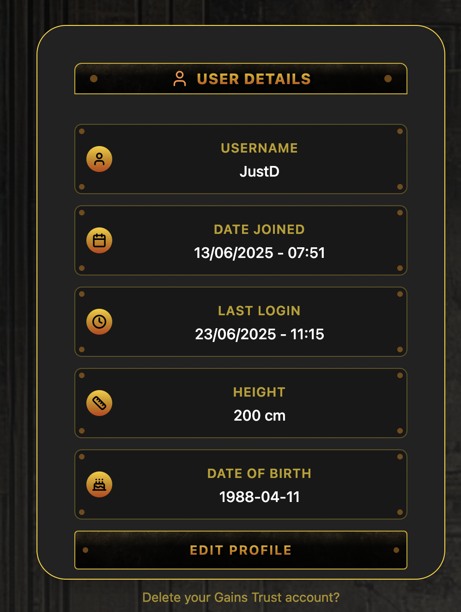
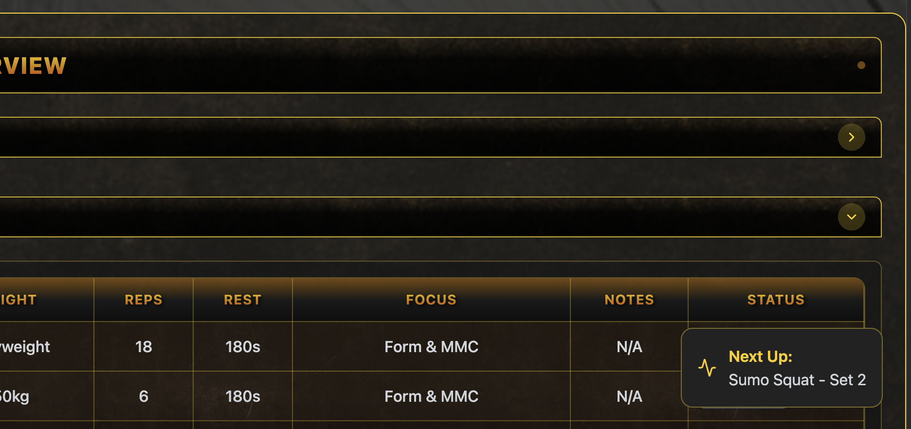

# 🏋️ Gains Trust

> **A full-stack fitness tracker that actually works.** Real-time timers, drag-and-drop workout building, and a UI that won't break under pressure. Built solo, deployed live, and ready to impress... Hopefully...

## 🌐 [Try It Live](https://gains-trust-unchained-ece4a.ondigitalocean.app/)


---

## ⚡ What Makes This Special

This isn't just another CRUD app with a fitness theme. Gains Trust showcases **real engineering solutions** to complex problems:

🎯 **Multi-Timer State Management** — Multiple timers running simultaneously with cross-session persistence  
🎨 **Smooth Drag & Drop** — Native HTML5 implementation with optimistic updates and rollback  
🔐 **Security-First Auth** — Creative JWT + Django hybrid with login awareness features  
📱 **Collision-Proof UI** — Dynamic responsive layouts that never overlap or break  
⚡ **Instant Feedback** — Optimistic updates make everything feel lightning-fast  

## 🚦 Tech Stack

**Frontend:** React 18 • Zustand • Tailwind CSS • Framer Motion  
**Backend:** Django REST Framework • PostgreSQL • Custom JWT Auth  
**Deployment:** DigitalOcean • Production-ready setup  
**Extras:** HTML5 Drag & Drop • React Portals • SMTP Integration

## 🎬 See It In Action

### 📹 Complete User Guide
**[Watch the Full App Walkthrough](screenshots/GainsTrustUserGuide.mov)**  
*Complete demonstration of all features — from registration to live workout tracking*

### Multi-Timer Persistence

*Timers survive page refreshes, navigation, and even browser crashes*

### Drag & Drop Reordering  

*Smooth, visual reordering with instant feedback and error handling*

### Dynamic Layout Prevention

*Panels intelligently reposition to prevent UI collisions*

### Security-Aware Authentication

*Shows previous login time for security awareness — not just the current one*

### React Portal Rendering

*Modals and overlays that always appear where they should*

## 🛠️ Key Features

### For Users
- **Live Workout Tracking** with multiple concurrent timers
- **Visual Workout Builder** with drag-and-drop set reordering  
- **Smart Rest Timers** that pause and resume automatically
- **Responsive Design** that works on phone, tablet, and desktop
- **Secure Account Management** with password recovery

### For Developers
- **Advanced State Management** with Zustand persistence
- **Optimistic UI Updates** for instant user feedback
- **Custom Authentication** combining JWT with Django User model
- **PostgreSQL Arrays** for efficient data storage
- **React Portals** for complex UI management
- **Production Deployment** with proper error handling

## 🚀 Quick Start

### Option 1: Try the Live Demo
Visit [https://gains-trust-unchained-ece4a.ondigitalocean.app/](https://gains-trust-unchained-ece4a.ondigitalocean.app/) — no installation needed.

### Option 2: Run Locally

```bash
# Clone the repo
git clone https://github.com/yourusername/Gains_Trust_Unchained.git
cd Gains_Trust_Unchained

# Backend setup
cd Gains_Trust
pip install -r requirements.txt
python manage.py migrate
python manage.py runserver

# Frontend setup (new terminal)
cd ../frontend
npm install
npm start
```


## 🎯 Project Highlights

### Real-World Engineering
- **Technical debt management** with clear prioritisation
- **Performance optimisation** for timer efficiency and memory management
- **Error handling** that degrades gracefully
- **Security practices** including data filtering and token management

### Production Ready
- **Deployed on DigitalOcean** with proper WSGI setup
- **Environment-based configuration** for different deployment stages
- **Database migrations** handled properly
- **Static file serving** configured for production

### Learning Journey
- **Flask → Django migration** showing framework evolution
- **MongoDB → PostgreSQL** transition with data modeling improvements  
- **Vanilla JS → React** upgrade with modern patterns
- **REST API design** with pragmatic custom endpoints where needed

## 📊 What's Next (v2 Roadmap)

**High Priority:**
- 📚 Exercise database with instructions and form cues
- 📈 Actual vs. planned performance tracking with PR history
- 🎨 Advanced analytics and progress visualization

**Medium Priority:**
- 🔧 API consistency improvements and DRF pattern adoption
- ⚡ Database query optimization for larger datasets
- 🧪 Expanded test coverage

**Completed in v1:**
- ✅ Multi-timer state management with persistence
- ✅ Drag & drop workout building with optimistic updates  
- ✅ JWT authentication with security awareness
- ✅ Dynamic responsive layouts with collision prevention
- ✅ SMTP password recovery with time-limited tokens
- ✅ Production deployment on DigitalOcean

## 🤝 Technical Discussion

Want to dive deeper into the technical implementation? Check out the **[Technical Walkthrough](TechWalkthrough.md)** for detailed code examples, architecture decisions, and lessons learned.

**Topics covered:**
- Advanced React patterns and state management
- JWT + Django authentication hybrid approach
- HTML5 drag & drop implementation details
- Responsive layout collision prevention
- Strategic technical debt management


---

*Built with intention, then deployed with confidence. When you are solving a real problem that you encounter in everday life, the solutions and requirements are much more obvious than when you are trying to anticipate the user's needs and the scope for building iteratively increases massively*
